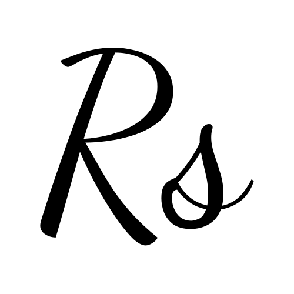

<!-- PROJECT LOGO -->
 

  

<h3 align="center">Resta - restaurant's website</h3>

  

    A restaurant's responsive, fast and modern website, designed to showcase the restaurant's menu, reviews and information with CMS for easy, no-code content managment.
     
    <a href="https://resta.rivenintech.com"><strong>View Live Site »</strong></a>
  

<!-- TABLE OF CONTENTS -->

  
Table of Contents

  <ol>
    <li>
      <a href="#about-the-project">About The Project</a>
      <ul>
        <li><a href="#built-with">Built With</a></li>
        <li><a href="#gallery">Gallery</a></li>
        <li><a href="#cms-panel-video-showcase">CMS Panel Video Showcase</a></li>
      </ul>
    </li>
    <li><a href="#contact">Contact</a></li>
  </ol>

<!-- ABOUT THE PROJECT -->

## About The Project

### Built With

- [![Astro][Astro]][Astro-url]
- [![TailwindCSS][TailwindCSS]][TailwindCSS-url]
- [![React.js][React.js]][React-url]
- [![shadcn/ui][shadcn/ui]][shadcn/ui-url]
- [![Cloudflare Pages][cf-pages]][cf-pages-url]
- [![SveltiaCMS][sveltia-cms]][sveltia-cms-url]

### Gallery

| Desktop | Mobile |
| --- | --- |
| ![Desktop page screenshot][desktop-screenshot] | ![Mobile page screenshot][mobile-screenshot] |

(<a href="#readme-top">back to top</a>)

### CMS Panel Video Showcase

It is impossible to allow view access to CMS panel to anyone on the live website as it is based on the repository access permissions, so instead here is a short video showcase of the /admin page.

[![Watch the video][yt-cms-video-thumbnail]][yt-cms-video-url]

(<a href="#readme-top">back to top</a>)

<!-- CONTACT -->

## Contact

[rivenintech.com][my-website-url] - All of my socials, contact information and other projects can be found on my website.

(<a href="#readme-top">back to top</a>)

<!-- MARKDOWN LINKS & IMAGES -->
<!-- https://www.markdownguide.org/basic-syntax/#reference-style-links -->

[desktop-screenshot]: ./public/desktop-preview.png
[mobile-screenshot]: ./public/mobile-preview.png
[yt-cms-video-url]: https://youtu.be/ziYV7aiXR-g
[yt-cms-video-thumbnail]: ./public/cms-preview.png
[my-website-url]: https://rivenintech.com/
[Astro]: https://img.shields.io/badge/astro-BC52EE?style=for-the-badge&logo=astro&logoColor=white
[Astro-url]: https://astro.build/
[TailwindCSS]: https://img.shields.io/badge/tailwindcss-06B6D4?style=for-the-badge&logo=tailwindcss&logoColor=white
[TailwindCSS-url]: https://tailwindcss.com
[React.js]: https://img.shields.io/badge/React-20232A?style=for-the-badge&logo=react&logoColor=61DAFB
[React-url]: https://reactjs.org/
[shadcn/ui]: https://img.shields.io/badge/shadcn/ui-000000?style=for-the-badge&logo=shadcn/ui&logoColor=
[shadcn/ui-url]: https://pages.cloudflare.com/
[cf-pages]: https://img.shields.io/badge/Cloudflare%20Pages-F38020?style=for-the-badge&logo=cloudflarepages&logoColor=white
[cf-pages-url]: https://pages.cloudflare.com/
[sveltia-cms]: https://img.shields.io/badge/Sveltia%20CMS-F85605?style=for-the-badge
[sveltia-cms-url]: https://github.com/sveltia/sveltia-cms
